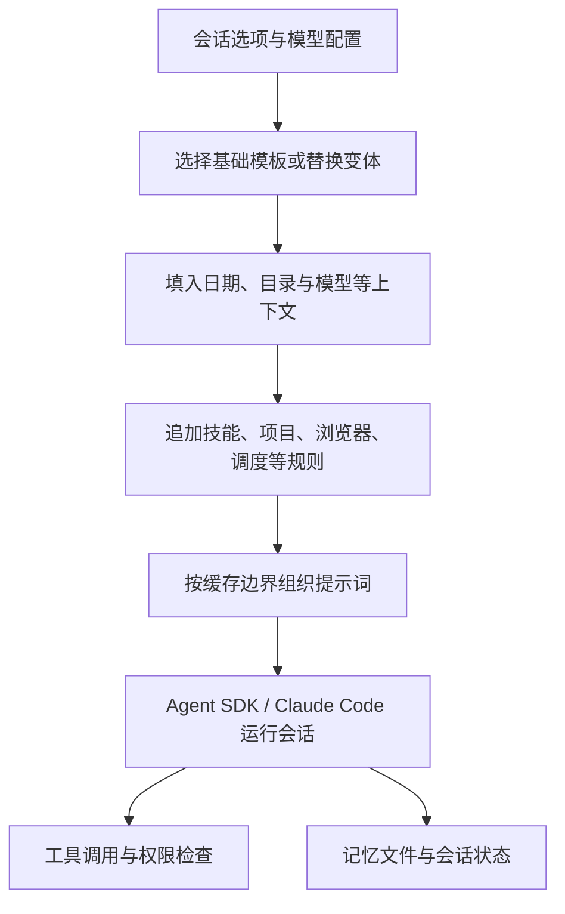

# 第二轮：提示词装配、记忆与执行边界

检查日期：2026-10-05。对象仍为 **Claude Desktop 2.19675.0.0 / Windows ARM64**。重新确认安装版本和安装包哈希未变；本轮使用的四个 JavaScript 文件与同版本汉化前备份逐字节一致。

这次进一步确认了三层机制：**按场景拼接的提示词、负责工具和权限的客户端程序，以及保存上下文的文件与会话状态**。这些证据可以解释部分产品行为，但不能测量模型权重的能力，也不能证明某项功能在特定账号上实际启用。

## 新找到的五份文本

| 文本 | 中文 | 英文 | 范围 |
|---|---|---|---|
| Chat 模式行为规则 | [中文](prompts/chat-behavior.zh-CN.txt) | [英文](prompts/chat-behavior.en.txt) | `jO` 常量，110 行；由 Chat 模板 `AO` 引用，含拒绝处理、行动与澄清、表达、用户福祉、公平性和知识截止日期规则 |
| Dispatch 协调者 | [中文](prompts/dispatch-orchestrator.zh-CN.txt) | [英文](prompts/dispatch-orchestrator.en.txt) | `HO` 常量，31 行；远程协调任务时附加的规则 |
| 持久记忆规则 | [中文](prompts/memory-guidelines.zh-CN.txt) | [英文](prompts/memory-guidelines.en.txt) | `Vd` 常量，132 行；默认记忆说明的主体，不含运行时目录和全部可能的附加内容 |
| 敏感信息记忆规则 | [中文](prompts/memory-sensitive.zh-CN.txt) | [英文](prompts/memory-sensitive.en.txt) | `Wd` 常量，11 行；可被运行时配置覆盖的默认附加说明 |
| 工作中插话 | [中文](prompts/aside-instructions.zh-CN.txt) | [英文](prompts/aside-instructions.en.txt) | `Ef` 模板，11 行；保留未展开的 `${e}` 用户消息表达式 |

这里的“完整”仅指所列常量或模板的文本完整，不代表某次会话的完整最终系统提示词。原文中的示例公司、行程、日期和身份均是安装包自带示例，与本次检查者的私人资料无关。

## 1. 提示词有装配流程，也可以按模型替换

模型对应的配置项可以选择 `append` 或 `replace`。`fn` 检查模型映射、变体键、模式和文本；`replace` 文本还必须带有 `{{promptCacheBoundary}}`。`JO` 再处理日期、时区、工作目录、选中文件夹、技能目录、模型标识、账号名称与邮箱等占位符，并追加工具与环境规则。

所以，同一个桌面版本不必对应唯一一份提示词。代码支持按模型和运行时配置改变文本；本次没有获取配置服务的实时响应，不能断言某个具体变体正在生效。[证据 E01、E02](evidence.md)

## 2. Chat 和 Cowork 的“先问还是先做”存在明确差异

新提取的 Chat 行为规则写道：缺少次要细节时，先作合理尝试；只有缺少必要信息、确实无法回答时才先问；能用工具消除歧义，就先调用工具；开始任务后要完成。

此前提取的 Cowork 基础模板则在多步骤任务中更强调先使用提问工具，同时允许在需求已经清楚或已澄清时跳过。两者属于不同模板，不能把其中任意一句推广为整个产品永远遵循的统一规则。

`AO` 还根据 `advancedFileAnalysisEnabled` 分成两种 Chat 环境描述：一种允许在隔离环境执行命令，另一种明确不允许执行代码。具备文件分析能力的分支仍声明不能借此任意访问用户电脑。[证据 E03](evidence.md)

## 3. Dispatch 的即时回应有单独的产品规则

Dispatch 模板把协调者定位为任务路由者：自己不承担任务执行，使用工具创建或继续任务，再转达结果。它要求所有用户可见消息都走 `SendUserMessage`，因为普通助手文本在该界面中不显示。

它还规定像发消息一样沟通，短问题短答、按意思拆分消息、不要项目符号或粗体、不要重复界面已经显示过的问候。界面的沟通风格因此至少部分来自明文规则，而不是仅由模型自行决定。

这是 `isBridgeSession` 对应的附加内容，不能推断普通桌面会话也使用同样的消息渲染方式。[证据 E04](evidence.md)

## 4. “工作中还能马上回话”有独立的旁路响应流程

`Ef` 要求对工作期间收到的新消息用一到三句话立即回答；修改要求只能说已经排到下一步，不能说已完成；说“停下”时需区分下一步停下与停止按钮立即中止。

调用点把这段文本交给从当前 query 取得的函数，维护 `pending`、`done`、`failed` 等状态，并设置 45 秒超时。这证明客户端专门处理了工作中插话；这段代码本身不能证明用了另一种模型，也不能证明整个主任务一直在连续推理。[证据 E05](evidence.md)

## 5. 长期连续性的一部分来自文件化记忆

内置记忆规则把内容分为 `user`、`feedback`、`project`、`reference` 四类。每条记忆有独立文件，`MEMORY.md` 作为索引；规则写明索引超过 200 行的部分会被截断。模板鼓励尽早记录、保存决策原因与失败经验，也要求重新核实可能变化的来源。

代码中的 `ensureMemoryIndexSnapshot` 会读取 `MEMORY.md`，并根据会话、目录与配置的闲置时间阈值决定是否复用索引快照。启动路径通过环境参数传递记忆目录、索引内容和规则；没有可用目录时设置禁用自动记忆的标志。

因此可以确认这里存在**读取既往文本来恢复上下文**的机制。是否具有“持续意识”不属于这种静态检查能得出的结论。[证据 E06、E07](evidence.md)

规则里也有值得注意的张力：一方面鼓励频繁写入研究发现，另一方面又排除临时分析结果、当前对话状态和可重新获取的信息。这要求模型判断哪些是长期有用的新结论，不能仅靠“经常保存”保证记忆准确。

## 6. 技能是说明文本、工具脚本和加载规则的组合

技能生成器综合组织提供的技能、随应用提供的技能、本地插件和远程插件，处理启用状态、名称冲突与可发现性，生成 `<available_skills>`。列表中有的条目提供文件位置，有的要求调用 `Skill` 工具。

生成文本明确说明：某些 `${CLAUDE_PLUGIN_ROOT}` 和 `${CLAUDE_SKILL_DIR}` 占位符由 `Skill` 工具展开；只读磁盘上的技能缓存，不等于更新了用户保存的技能。可保存时要用 `save_skill`，禁用时则告知能力或组织设置限制。[证据 E08](evidence.md)

安装包自带的文档技能进一步体现了这一层的工程作用：

| 技能 | 本地说明中的具体做法 |
|---|---|
| Word | 创建文档用 `docx`，编辑已有文档则处理 OOXML；还要求渲染和检查输出 |
| PowerPoint | 用 `pptxgenjs` 创建，并有文件结构与视觉检查流程；说明明确提醒“能被 LibreOffice 渲染”不等于“PowerPoint 一定能正常打开” |
| Excel | 用 `openpyxl` 等处理工作簿，带公式时要求重新计算，并提醒“公式能计算”不等于“业务计算正确” |
| PDF | 将文本提取、页面图像检查、OCR、表格/附件提取与制作操作分开处理 |

这些是被检查技能的要求，并非本次重新测试了所有依赖或证明每次生成结果都合格。

## 7. 工具权限有程序级检查

HostLoop 路径把本机 Read/Write/Edit 等文件工具与隔离 Linux 环境的命令执行区分开。提示词为模型描述两套路径如何对应，而工具调用之前还存在实际代码检查：路径参数形式、绝对路径、解析后的访问范围、被撤销授权、只读范围以及系统/凭据/Claude 内部保护区域。路径检查出错时，返回阻止调用，而不是默认放行。[证据 E09](evidence.md)

另有受管理的允许/拒绝规则和 `PreToolUse` 钩子，可把指定工具强制转为请求批准。这表明至少部分权限由程序执行，不只是一句“请遵守规则”。本轮没有运行绕过测试，也不能据此宣布所有边界无漏洞。[证据 E10](evidence.md)

电脑控制也存在两套不同安全文案：普通分层文案将浏览器、终端/IDE 与其他应用区别对待；`cuOnlyMode` 分支则选择另一份文案。它们不能脱离分支条件混作一套权限说明。

## 8. 部分网络限制也由代码执行

发现的 `hf` 检查限定 HTTP/HTTPS、拒绝被识别为本地或私有地址的目标，并检查网络允许列表。没有允许列表时，这一路径明确拒绝抓取。抓取器通过 `refuseTarget` 接入该检查，权限入口也在相应网络策略条件下调用它。

源码还存在其他审批和抓取分支，因此这段证据只说明该调用路径有检查，不能推广成桌面端所有网络请求都使用同一策略。[证据 E11](evidence.md)

## 核验与边界

- 使用 JavaScript 语法解析器读取安装包代码，对白名单内的常量表达式做静态展开；没有执行被检查的应用代码。
- 四个相关源文件与汉化前备份逐字节一致；详见 [来源与节点位置](provenance.json)。其中偏移单位为 UTF-16，证据摘录另明确标注其位置单位。
- 五组译文的行数、XML 标签、运行时占位符和行内代码均通过对照检查，没有 Unicode 替换字符；详见 [翻译检查](translation-check.json)。记忆格式示例中的占位符原样保留。
- 没有读取或发布实际用户记忆、聊天内容、账号凭据；没有启动 Claude 会话或调用其模型接口。这些规则是研究对象，不是本次助手执行任务的指令。
- 本文与译文为非官方整理。英文原文的归属与范围声明见 [上一级说明](../README.md)。
