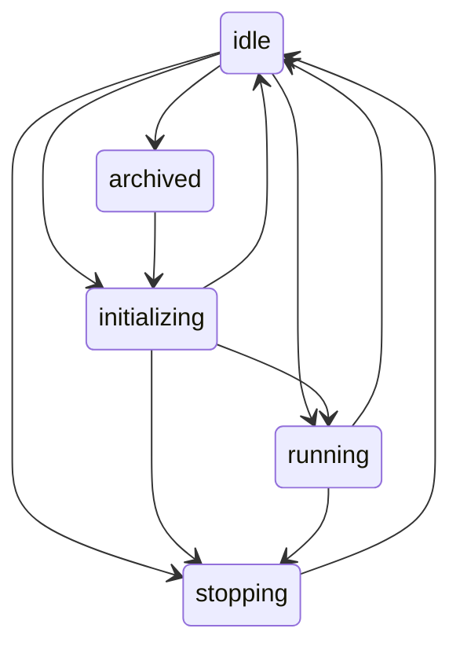

# 第三轮：会话如何继续、停止、定时启动，以及页面内的模型调用

检查日期：2026-10-05；Claude Desktop **2.19675.0.0 / Windows ARM64**。安装版本和安装包哈希与前两轮相同。这一轮继续只读分析安装包，不启动真实会话，不读取个人聊天或记忆。

最值得注意的发现是：桌面端分别管理**会话状态、进程生命周期、未交付消息、工具审批和后台调度**。这些对象相互关联，但不能用一个“正在运行”概括全部情况。另有专门服务于仪表盘的单次模型调用，能力与普通任务会话明显不同。

## 新增提示词中英对照

| 文本 | 中文 | 英文 | 来源 |
|---|---|---|---|
| 定时任务使用规则 | [中文](prompts/scheduled-tasks.zh-CN.txt) | [英文](prompts/scheduled-tasks.en.txt) | `zO`；工具名已通过常量解析还原 |
| 动态 HTML 页面使用规则 | [中文](prompts/artifacts-template.zh-CN.txt) | [英文](prompts/artifacts-template.en.txt) | `BO`；拼接的两个分支用 `${i}`、`${r}` 表示 |
| 页面内单次信息综合调用 | [中文](prompts/dashboard-synthesis.zh-CN.txt) | [英文](prompts/dashboard-synthesis.en.txt) | `$Bi`；保留运行时 UTC 日期表达式 |

`${i}` 选择是否允许加载指定 CDN 库；`${r}` 选择是否建议优先使用 ClaudeDesign。完整分支文本见 [中文选项](prompts/artifacts-options.zh-CN.json) / [英文选项](prompts/artifacts-options.en.json)。这些占位符是静态展开时对拼接位置的明确标示，不代表原始函数已经返回了某一运行时结果。

## 1. “空闲”和“进程退出”是不同状态

会话的 `VALID_TRANSITIONS` 明确列出五种状态与允许的转换。没有符合表中规则的转换会被忽略。

一轮任务正常结束进入 `idle` 时，程序会根据保温时限、活动中的 Workflow、会话类型和策略决定保留进程还是清理进程。保留时还能更新 MCP 工具配置；不保留时调用清理函数关闭 query、清空输入流并关闭该会话的运行时插件服务。

因此，进程存在不等于模型持续生成；进入空闲也不必然表示操作系统进程已经退出。这里确认的是代码分支，未测量实际保温时长。[证据 E01、E02](evidence.md)

## 2. 停止、中断与消息排队各有处理

`interruptTurn` 尝试中断关联子任务和当前运行中的 query。`stopSession` 则增加初始化与主动停止的代数标记、结束输入流、清除启动队列，并通过状态转换进入空闲。结束一轮时，未回答的权限请求会被拒绝，电脑控制占用和部分临时状态会被释放。

队列交付前保存主动停止代数；如果期间发生停止、中断或回退，代数变化会让剩余消息停止交付，避免旧排队消息又启动工作。

另有一个精确限定的过期规则：**被重新暂存且无人值守的启动消息**，超过 30 分钟会被丢弃。这不是所有用户消息统一的 30 分钟有效期。主动停止也不应被理解成撤销此前已完成的外部操作：所检查的停止路径展示的是执行清理，没有提供通用事务回滚。[证据 E03、E04](evidence.md)

## 3. 重启后的连续性来自恢复记录和续接会话

保存函数记录会话 ID、CLI 会话 ID、模型、目录授权、工具配置、提示词配置、待处理通知及相关状态。加载时会重新校验记录、过滤已经删除或不再符合允许根目录的文件夹，并恢复为 `idle` 或 `archived`；运行中的 query 和输入流不会从 JSON 中“复活”，而是设为 `null`。

后续启动路径可以把已有 CLI 会话 ID 交给 SDK 的 `resume`。回退分支另有 `resumeSessionAt` 与 `forkSession`。这与第二轮看到的文件化长期记忆是不同机制：一个续接会话记录，一个为未来任务提供持久上下文。[证据 E05、E06](evidence.md)

## 4. 审批不是简单的一次弹窗

客户端把待审批请求存在单独的映射中，包含请求 ID、所属会话、工具、输入、请求时间和回调。回答会被区分为本次允许、带持久规则的允许或拒绝；某些工具和启动方式会过滤掉持久授权部分。请求被中止、会话结束时，也有拒绝和清理逻辑。

因此，生命周期表里的 `running` 并不能单独证明任务在推理：等待审批也有另外的状态数据，需要一起看。[证据 E07](evidence.md)

定时任务复用历史审批时，还会检查规则覆盖范围、过期时间和较新的组织限制。部分工具类别明确要求现场审批，例如相关浏览器/电脑授权、持久账户写入和定时任务管理。这是所检查路径的规则，不代表所有工具都必须每次弹窗。[证据 E08](evidence.md)

## 5. 定时任务到点之后还要经过多道判断

发现的本地调度检查包含：功能是否允许、唤醒后的等待期、网络状态、渲染端监听是否就绪、执行位置、派发条件、凭据检查、任务启用状态、已有活动会话、任务文件存在性、重试退避与派发限流。重复任务还处理漏跑时间段和错开派发的延迟。

所以，“已经设置了时间”只能证明存在计划，不能证明任务已经成功启动。这是本地调度路径的观察，不能概括所有远程执行方式。[证据 E09](evidence.md)

对于启用了 watcher 的任务，还有前置触发判断：如果固定过脚本 SHA-256，脚本改变后会跳过并要求重新批准；执行错误会跳过；返回的触发分数要达到阈值，默认阈值为 0.7。这里的 0.7 是触发门槛，不是模型答案正确率。未达到条件时会推进相应调度状态而不派发该次任务会话。[证据 E10](evidence.md)

卡住的定时运行也有条件式清理：配置开启时，可以先拒绝无人回答的审批，让任务收尾；或者停止卡住的运行，释放并发位置。代码中有默认值，但本轮没有读取当前账号的实时开关。[证据 E11](evidence.md)

## 6. 仪表盘可以调用一个受限的单次模型请求

页面预加载桥接公开了 `callMcpTool`、`askClaude` 和 `runScheduledTask`。`askClaude` 的专用提示词要求只做摘要、分类、提取等转换，直接输出组件要显示的内容，不得提问或调用工具。

底层单次采样实现同时设置 `maxTurns: 1`、空的允许工具列表、拒绝工具的回调以及 `persistSession: false`。这里的“不保存会话”指此采样器的 SDK 会话设置；页面层仍有成功结果缓存，不能据此声称完全不保存数据。凭据撤销通知还会中止在途的此类采样请求。[证据 E12、E13](evidence.md)

页面文案把它描述为快速 Haiku 推理，但实际代码先读取模型覆盖值和 provider 的默认模型，最后才在相应条件下使用硬编码的 Haiku 回退值。因此，单凭文案不能认定每次页面调用都用了同一个模型。

页面手动触发定时任务另有实际用户操作标记、确认、任务存在性和页面仍在显示等检查。连接器调用也检查工具是否列入该页面的声明范围。嵌入一个页面，不等于赋予它任意调用所有工具的权限。[证据 E14](evidence.md)

## 验证与限制

本轮使用语法树读取函数和静态常量，只执行自写的解析与核验程序，不运行被检查的产品代码。相关源文件与汉化前备份的逐字节比对、节点位置、SHA-256 见 [来源说明](provenance.json)；译文结构检查见 [检查结果](translation-check.json)。

没有读取真实会话存储、实际用户记忆或凭据，也没有触发定时任务、模型推理或审批。公开材料只含程序自带文本、有限代码摘录和分析。英文内容归属及非官方声明沿用 [主说明](../README.md)。
